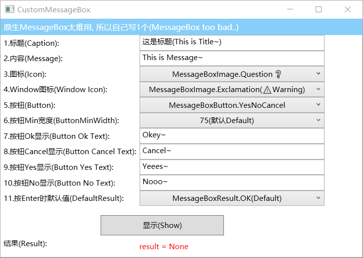
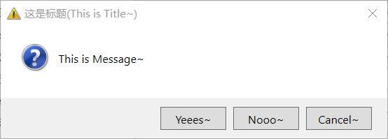

# CustomMessageBox
一个可定制的 WPF MessageBox 控件。(A custom MessageBox)
> <a href="https://github.com/actor20170211030627/CustomMessageBox" target="_blank">Github</a>

## 1.Screenshot
</img>  
</img>

## 2.Sample
<a href="https://github.com/actor20170211030627/CustomMessageBox/releases/latest/download/CustomMessageBox.exe" target="_blank">download</a>

## 3.How to
To get a Git project into your project:

**Step 1.** 在 Rider 的 NuGet 源设置中添加源(Add Source into u NuGet)  
  Open NuGet  ->  Sources  ->  Add(➕️):
<pre>
  name    : actor20170211030627
  URL     : https://nuget.pkg.github.com/actor20170211030627/index.json
  User    : Keep Empty(保持空不填)
  Password: Keep Empty(保持空不填)
</pre>
-> Click Ok

**Step 2.** 在 NuGet 中搜索 CustomMessageBox 安装即可(Search CustomMessageBox in NuGet)
